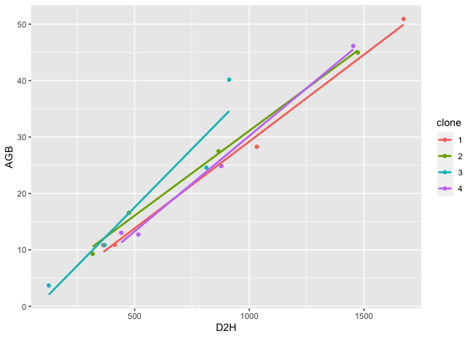
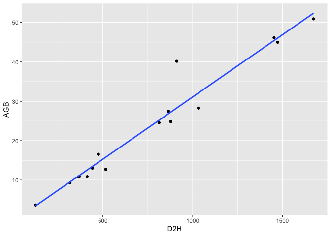

# Biomass_DBH_allometry

## 1. บทนำ

ในการวิเคราะห์นี้จะพยายามอธิบายความสัมพันธ์ระหว่าง D2H และ AGB
ว่าแตกต่างกันหรือไม่ระหว่าง clone

- ถ้าแตกต่างกัน จะต้องใช้สมการ allometry แตกต่างกันระหว่าง clone

- ถ้าไม่แตกต่างกัน สามารถใช้ข้อมูลร่วมกันเพื่อสร้าง allometry เดียวได้เลย

## 2. นำข้อและอธิบายข้อมูล

ข้อมูลจากทางกรมป่าไม้ แสดงค่าของต้นไม้จำนวน 4 clone โดยวัดค่าต่อไปนี้

- DBH = เส้นผ่านศูนย์กลางเพียงอก (diameter at breast height) หน่วย cm

- H = ค่าความสูง (height) หน่วย m

- D2H = ค่า DBH ยกกำลังสอง คูณด้วยค่า H หน่วย $cm^2m$

- AGB = มวลชีวภาพเหนือพื้นดิน (Aboveground biomass) หน่วย kg

``` r
library(tidyverse)
```

    ── Attaching packages ─────────────────────────────────────── tidyverse 1.3.2 ──
    ✔ ggplot2 3.4.2     ✔ purrr   0.3.4
    ✔ tibble  3.1.8     ✔ dplyr   1.0.9
    ✔ tidyr   1.2.0     ✔ stringr 1.4.0
    ✔ readr   2.1.2     ✔ forcats 0.5.1
    ── Conflicts ────────────────────────────────────────── tidyverse_conflicts() ──
    ✖ dplyr::filter() masks stats::filter()
    ✖ dplyr::lag()    masks stats::lag()

``` r
library(readxl)

biomass <- read_excel("allometry_RDF.xlsx")
biomass
```

    # A tibble: 16 × 5
       clone   DBH     H   D2H   AGB
       <dbl> <dbl> <dbl> <dbl> <dbl>
     1     1   6.8  8.93  413. 10.9 
     2     1   6.1  9.77  364. 10.8 
     3     1   9.3 11.9  1033. 28.3 
     4     1  11.5 12.6  1673. 50.9 
     5     2   5.9  9.1   317.  9.28
     6     2   7.3  8.91  475. 16.6 
     7     2   8.9 10.9   866. 27.5 
     8     2  10.9 12.4  1473. 45.0 
     9     3   4.5  6.2   126.  3.68
    10     3   6.4  9     369. 10.8 
    11     3   8.6 11.0   813. 24.6 
    12     3  10    9.12  912  40.2 
    13     4   7    9.01  441. 13.0 
    14     4   7.5  9.17  516. 12.7 
    15     4   9.3 10.2   878. 24.8 
    16     4  11.6 10.8  1453. 46.1 

## 3. วิเคราะห์ความแตกต่างของความชันระหว่างพื้นที่

เริ่มต้นจากการวาดภาพเพื่อแสดงความสัมพันธ์ระหว่าง D2H และ AGB
ว่าแตกต่างกันหรือไม่ระหว่าง clone

``` r
biomass %>% 
  ggplot(aes(x = D2H, y = AGB, color = factor(clone))) +
  geom_point() +
  geom_smooth(method = "lm", se = F) +
  labs(color = "clone")
```

    `geom_smooth()` using formula = 'y ~ x'



จะเส้นว่าความชันของแต่ละเส้นนั้น ไม่แตกต่างกันมา ยกเว้น clone 3 ที่อาจจะชันกว่า clone
อื่น ๆ เล็กน้อย

เราสามารถวิเคราะห์ว่า slope มีความแตกต่างกันจริงหรือไม่ระหว่าง clone โดยการทำ
Analysis of Covariance (ANCOVA) ซึ่งถ้า slope แตกต่างกันจริง ค่าสัมประสิทธิ์
(coefficient) ของพจน์ปฏิสัมพันธ์ (interaction term) ในสมการนี้จะต้องมีค่าต่างจาก 0
อย่างมีนัยสำคัญ

``` r
biomass_lm <- lm(AGB ~ D2H + clone + D2H:clone, data = biomass)
biomass_ancova <- anova(biomass_lm)
biomass_ancova
```

    Analysis of Variance Table

    Response: AGB
              Df Sum Sq Mean Sq  F value    Pr(>F)    
    D2H        1 3212.4  3212.4 223.2084 4.068e-09 ***
    clone      1    3.1     3.1   0.2120    0.6534    
    D2H:clone  1    6.7     6.7   0.4622    0.5095    
    Residuals 12  172.7    14.4                       
    ---
    Signif. codes:  0 '***' 0.001 '**' 0.01 '*' 0.05 '.' 0.1 ' ' 1

จากผลการวิเคราะห์ข้างต้น แสดงให้เห็นว่า

- ความแตกต่างระหว่าง clone ไม่มีนัยสำคัญที่ P = 0.653

- ปฏิสัมพันธ์ระหว่าง D2H:clone ไม่มีนัยสำคัญที่ P = 0.509

ดังนั้นข้อมูลจาก clone ทั้ง 4 ไม่มีความแตกต่างกันอย่างมนัยสำคัญ
สามารถรวมข้อมูลเพื่อผลิตสมการเดียวกันได้เลย โดยจะได้สมการดังต่อไปนี้

$$
AGB = intercept + slope \times D^2H 
$$

Intercept และ slope จะมาจากการวิเคราะห์ linear regression ระหว่าง D2H และ
AGB

``` r
biomass_lm <- lm(AGB ~ D2H, data = biomass)
summary(biomass_lm)
```


    Call:
    lm(formula = AGB ~ D2H, data = biomass)

    Residuals:
        Min      1Q  Median      3Q     Max 
    -3.8672 -1.4960 -0.3885  0.2990 11.8386 

    Coefficients:
                 Estimate Std. Error t value Pr(>|t|)    
    (Intercept) -0.479355   1.770874  -0.271    0.791    
    D2H          0.031584   0.002011  15.702 2.77e-10 ***
    ---
    Signif. codes:  0 '***' 0.001 '**' 0.01 '*' 0.05 '.' 0.1 ' ' 1

    Residual standard error: 3.61 on 14 degrees of freedom
    Multiple R-squared:  0.9463,    Adjusted R-squared:  0.9424 
    F-statistic: 246.6 on 1 and 14 DF,  p-value: 2.774e-10

สมการที่ได้จึงเป็นดังนี้ โดยมี $R^2$ = 0.9424

$$
AGB = -0.479355 + 0.031584 D^2H
$$

และกราฟที่ได้จะเป็นภาพดังนี้

``` r
ggplot(aes(x = D2H, y = AGB), data = biomass) +
  geom_point() +
  geom_smooth(method = "lm", se = F)
```

    `geom_smooth()` using formula = 'y ~ x'


